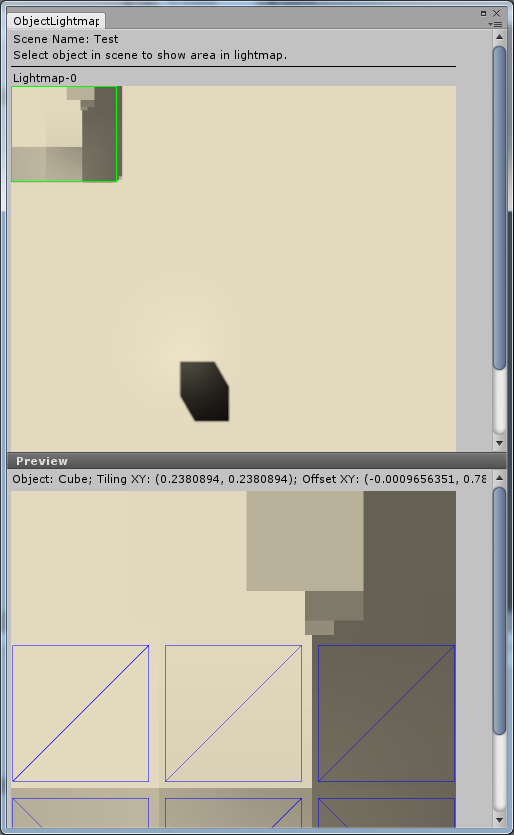

# ObjectLightmapViewer
Viewer of unity mesh renderer uv in baked lightmap.

## Requirements
* Unity 2017 or later.

## How to use
* Open a baked lightmap scene.
* Open this viewer at "Tools/Object Lightmap Viewer".
* Select a baked object to preview it's lightmap uv information in this viewer.

## Screenshot

